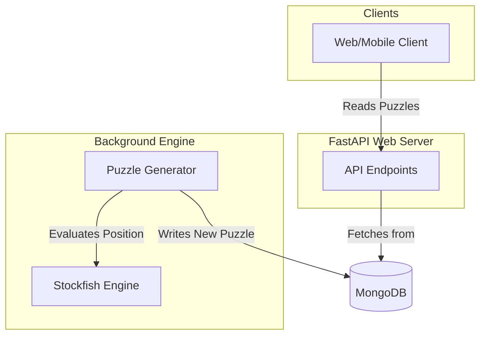

# ChessChallengers API

Backend service for generating and managing chess puzzles. Built with FastAPI using Clean Architecture.

## Architecture Overview

To keep the system simple and performant, the backend is split into two independent components:
1. **API App (Web)**: Fast, I/O-bound FastAPI service that consumes puzzles from the MongoDB database and serves them to clients.
2. **Generator**: A separate process that uses the Stockfish engine to generate puzzles and writes them directly into the MongoDB database.



## Prerequisites

- Python 3.8+
- MongoDB

## Installation

1. Clone the repository:
   ```bash
   git clone <repository-url>
   cd backend
   ```

2. Create a virtual environment:
   ```bash
   python3 -m venv venv
   source venv/bin/activate
   ```

3. Install dependencies:
   ```bash
   pip install -r requirements.txt
   ```

## Configuration

Create a `.env` file in the `backend` directory with the following configuration:

```env
PROJECT_NAME="Chess Puzzle API"
MONGODB_URI="mongodb://localhost:27017"
MONGODB_DB_NAME="chess_puzzles"
```

## Running the Server

Start the development web server:

```bash
uvicorn app_api.main:app --reload
```

The API will be available at `http://localhost:8000`.

## API Documentation

### Root Check

- `GET /` - Check if the API is running (returns a welcome message).

### Puzzles

#### Get Random Puzzle

```http
GET /api/v1/puzzles/random
```
**Response (200 OK):**
```json
{
  "id": "60a7c92b9b7a421a9c3d4e5f",
  "fen": "r1bqk2r/pppp1ppp/2n2n2/2b1p3/2B1P3/2N2N2/PPPP1PPP/R1BQK2R w KQkq - 4 5",
  "moves": [
    {"uci": "f3e5", "san": "Nxe5"}
  ],
  "rating": 1500,
  "themes": ["fork"]
}
```

#### Get Puzzle by ID

```http
GET /api/v1/puzzles/{puzzle_id}
```
**Response (200 OK):** Returns the requested puzzle object.

#### Manually Create Puzzle

```http
POST /api/v1/puzzles
```
**Request Body:**
```json
{
  "fen": "8/8/8/8/8/8/8/8 w - - 0 1",
  "moves": [{"uci": "e2e4"}],
  "rating": 1000,
  "themes": []
}
```
**Response (201 Created):** Returns the saved puzzle with its generated MongoDB `id`.

## Development

### Testing

Run the test suite (requires `pytest`):

```bash
pytest backend/tests/
```
