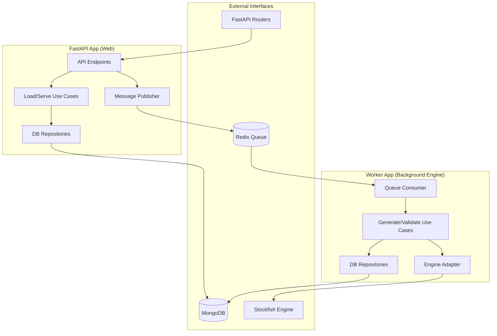

# Chess Puzzle App — Backend Specifications (Spec-Driven Development)

## 1. Overview

The backend is responsible for:
* Providing chess puzzles
* Validating puzzle structure (not user moves initially)
* Managing puzzle generation and storage

The backend should follow **Clean Architecture** and be **test-first (pytest)**. It is built using **FastAPI** to provide high-performance, asynchronous endpoints.

---

## 2. Architecture & Design

### Microservice Architecture (Clean Architecture)

To ensure high performance and prevent the CPU-heavy chess engine from blocking web requests, the system is split into two separate applications communicating via a Message Broker (Redis). Both apps follow Clean Architecture.



### Directory Structure

```text
backend/
├── app_api/                 # FastAPI Web Application
│   ├── api/                 # FastAPI routes and controllers
│   ├── core/                # Config, security, exceptions
│   ├── domain/              # Core entities (Puzzle, Move)
│   ├── infrastructure/      # MongoDB driver, Redis publisher
│   ├── services/            # Use cases (Load Puzzle, Get Random)
│   └── main.py              # FastAPI application entry point
├── app_worker/              # Background Engine Application
│   ├── consumer/            # Task consumer (Celery/Redis listener)
│   ├── domain/              # Core entities (Puzzle, Move)
│   ├── infrastructure/      # MongoDB driver, Stockfish integration
│   ├── services/            # Use cases (Generate Puzzle, Engine Validate)
│   └── worker.py            # Worker process entry point
├── tests/
│   ├── api/                 # Tests for the FastAPI app
│   └── worker/              # Tests for the engine worker (with mocked engine)
├── docker-compose.yml       # Orchestrates API, Worker, MongoDB, and Redis
└── requirements.txt         # Dependencies
```

### Database Strategy (MongoDB)

**MongoDB (NoSQL)** is chosen as the primary database.
- **Reasoning:** Puzzles are essentially self-contained documents (FEN, solutions, themes, engine evaluations). Using a document database provides maximum flexibility for storing complex, nested chess engine evaluations and puzzle metadata without being constrained by a rigid schema.
- **Tooling:** We will use Motor (the async Python driver for MongoDB) to integrate with FastAPI.

---

## 3. Core Domain Concepts

* **Puzzle:** A structured representation of a chess problem, containing a starting position (FEN) and a solution sequence.
* **Move:** A valid chess move, typically represented in UCI (Universal Chess Interface) format.
* **Solution:** A sequence of moves that solves the puzzle.
* **Difficulty:** An integer rating (e.g., Elo) representing how hard the puzzle is.

---

## 4. API Endpoints Contract

### `GET /api/v1/puzzles/{puzzle_id}`
- **Description:** Retrieve a specific puzzle by ID.
- **Response:** `200 OK` (Puzzle JSON), `404 Not Found`.

### `GET /api/v1/puzzles/random`
- **Description:** Retrieve a random puzzle, optionally filtered by difficulty or theme.
- **Query Params:** `min_rating`, `max_rating`, `theme`
- **Response:** `200 OK` (Puzzle JSON)

### `POST /api/v1/puzzles`
- **Description:** Create/import a new puzzle. Triggers validation.
- **Body:** `{ fen: string, solution: string[], ... }`
- **Response:** `201 Created`, `400 Bad Request` (Validation Failed)

### `POST /api/v1/puzzles/generate` (Internal/Admin)
- **Description:** Requests the generation of new puzzles. This endpoint does NOT block; it publishes a task to the Redis queue for the Worker App to process.
- **Response:** `202 Accepted` (Task queued)

---

## 5. Feature Specifications (BDD Scenarios)

### Feature: Load Puzzle
```
Scenario: Fetch puzzle by id
  Given a puzzle exists with id "1"
  When the client requests the puzzle
  Then the system returns the puzzle data

Scenario: Puzzle does not exist
  Given no puzzle exists with id "999"
  When the client requests the puzzle
  Then the system returns an error
```

### Feature: Get Random Puzzle
```
Scenario: Fetch random puzzle
  Given a list of puzzles
  When the client requests a random puzzle
  Then the system returns one puzzle
```

### Feature: Puzzle Structure Validation
*(Internal — used when creating or importing puzzles)*
```
Scenario: Valid puzzle
  Given a puzzle with a valid FEN and solution
  When the system validates the puzzle
  Then the puzzle is accepted

Scenario: Invalid FEN
  Given a malformed FEN string
  When the system validates the puzzle
  Then the puzzle is rejected

Scenario: Empty solution
  Given a puzzle without a solution
  When the system validates the puzzle
  Then the puzzle is rejected
```

### Feature: Engine Validation (Stockfish Integration)
```
Scenario: Single best move
  Given a puzzle position
  When the engine analyzes the position
  Then only one move is significantly better than others

Scenario: Multiple good moves
  Given a puzzle position
  When the engine finds multiple equally good moves
  Then the puzzle is rejected
```

### Feature: Generate Puzzle
```
Scenario: Generate candidate puzzle
  When the system generates a random position
  Then a candidate puzzle is created

Scenario: Validate generated puzzle
  Given a candidate puzzle
  When the system runs engine validation
  Then only valid puzzles are stored
```

### Feature: Store Puzzle
```
Scenario: Save valid puzzle
  Given a validated puzzle
  When the system saves it
  Then it is persisted

Scenario: Save invalid puzzle
  Given an invalid puzzle
  When the system attempts to save it
  Then it is rejected
```

### Feature: Difficulty Classification
```
Scenario: Assign difficulty
  Given a puzzle with engine evaluation data
  When the system evaluates difficulty
  Then a difficulty level is assigned
```

---

## 6. Notes & Implementation Rules

* All features must be covered with `pytest` tests using a test-first approach.
* Engine validation must be isolated via adapters and testable without the real engine (mocks/stubs).
* **Worker Isolation:** The CPU-heavy puzzle generation and engine validation must ONLY happen in the background Worker App, never in the FastAPI web process.
* **Crucial:** Keep domain logic completely independent of FastAPI request/response models and MongoDB database models. Use data transfer objects (DTOs) to map between layers.
